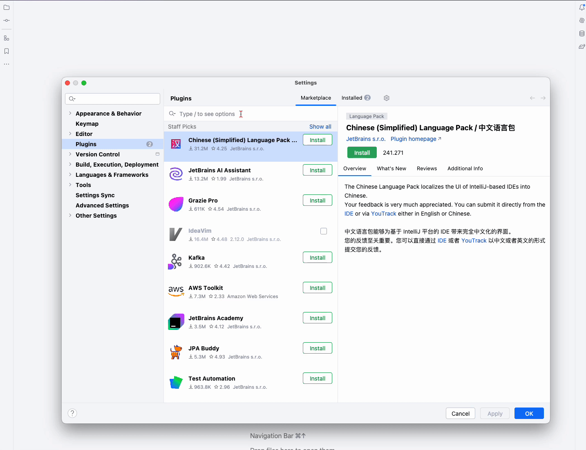
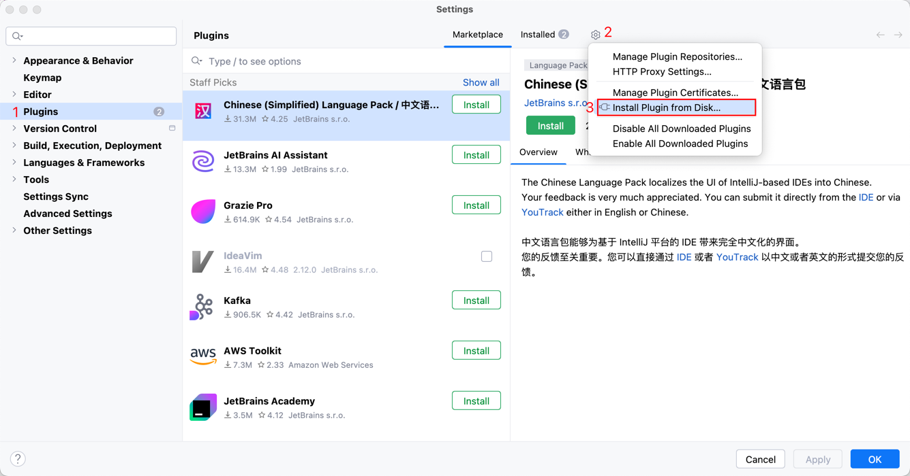

# 面试鸭 IDEA 插件

**面试鸭** 是一个帮助程序员在 JetBrains 系列产品中刷面试题的插件。插件题目全面、题解优质、支持多种筛选条件，是一款摸鱼刷题必备神器。

## 特性

- **题目丰富**：拥有 20+ 题库分类，近 200 题库，6000+ 题目，涵盖了几乎所有主流编程方向的面试题。
- **高质量题解**：许多题解来自大厂面试官原创，抓住核心要点，通俗易懂，配有图片辅助理解。
- **快捷键支持**：支持自定义快捷键，轻松一键打开或收起插件。
- **多条件筛选**：可通过题库、标签、难度等条件筛选，快速找到自己想要的题目。
- **讨论互动**：题目详情页面分为题目、推荐答案、讨论区三个子 tab，方便交流讨论。
- **多端同步**：支持 IDEA 及 JetBrains 系列其他产品，如 WebStorm、PyCharm 等。同时支持小程序和 Web 端，数据三端同步。
- **开源**：插件完全开源，代码托管在 GitHub，欢迎贡献和 Star 支持。

## 安装与使用

1. 打开 IntelliJ IDEA，进入 `Settings` > `Plugins`。
2. 搜索 `mianshiya`，点击安装。

搜索不到的小伙伴可以通过 JetBrains 插件市场下载，
> JetBrains 插件市场地址：https://plugins.jetbrains.com/plugin/25258-mianshiya

下载到本地之后按照下图步骤安装即可：

## 三端兼容

- **JetBrains 系列产品**：支持 IDEA、WebStorm、PyCharm 等 2021.3 及以上版本。
- **小程序端**：随时随地刷题。
- **Web 端**：[面试鸭 Web 端](https://mianshiya.com)

## 开源项目

插件代码完全开源，欢迎大家 Star 和贡献代码！

GitHub 地址：[https://github.com/yuyuanweb/mianshiya-plugin](https://github.com/yuyuanweb/mianshiya-plugin)

## 反馈与支持

如有问题或建议，欢迎通过 GitHub issue 提交反馈，或者直接联系我们。
